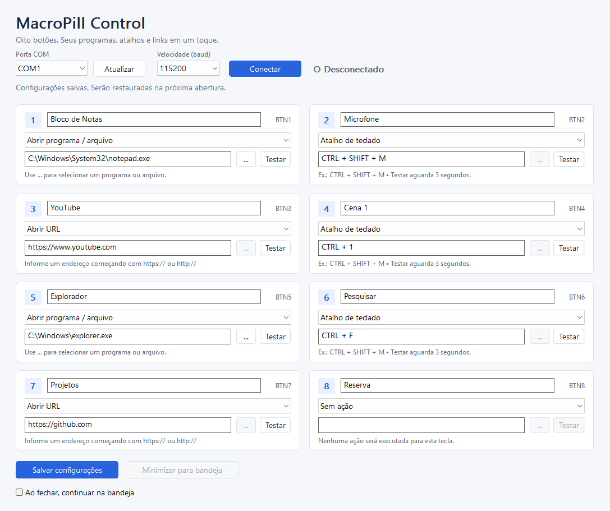

# OctoKey — MacroPill Control

Aplicativo desktop para Windows que transforma oito botões de uma STM32 Blue Pill em um macropad configurável. Escolha o que cada botão faz: abrir programas e arquivos, enviar atalhos de teclado ou abrir sites. As configurações ficam salvas no seu computador.

A placa envia `BTN1` até `BTN8` pela porta serial USB; o aplicativo recebe cada comando e executa a ação correspondente. O projeto é desenvolvido em C++17.

A interface usa a API nativa Win32. Não é necessário instalar Qt, Python, .NET ou um navegador para usar o aplicativo.

**Para usar sem compilar, baixe o pacote Windows x64 na [versão do OctoKey em Releases](https://github.com/ThyagoSilva02/apps-desktop/releases/tag/octokey-v1.0.0), extraia o ZIP e abra `MacroPillControl.exe`.** O botão Code → Download ZIP baixa o código-fonte; ele não inclui o aplicativo compilado. O código-fonte e as instruções abaixo permitem recompilar o aplicativo. A ação de abrir URL utiliza o navegador padrão que você já usa.

As versões são compiladas e testadas pelo GitHub Actions e acompanham hashes SHA-256 para conferência de integridade. Consulte [distribuição, assinatura digital e avisos do Windows](docs/distribution.md). Uma verificação sem ameaças em um antivírus não garante ausência de avisos em todos os computadores.



Os nomes e ações da imagem são exemplos de configuração. Uma primeira execução começa com as oito teclas sem ação.

## Recursos

- Seleção da porta COM e conexão/desconexão manual.
- Oito configurações independentes de botão.
- Abertura de programas e arquivos pelo Windows.
- Combinações de teclado com `SendInput`.
- Abertura de URLs no navegador padrão.
- Leitura serial em uma `std::thread` separada da interface.
- Configuração local restaurada ao iniciar o aplicativo.
- Operação em segundo plano com ícone na bandeja do sistema.

O firmware USB serial dos oito botões está na pasta `firmware`, com o código-fonte, BIN/HEX e [instruções de ligação e gravação](firmware/README.md). Ele foi gravado na STM32 e conferido por leitura. A USB serial foi reconhecida como **COM3** e recebeu os oito comandos em teste com entradas simuladas. Os botões físicos ainda precisam ser montados. Durante o uso, o aplicativo conversa com a porta COM criada pela USB da STM32.

## Requisitos

- Windows 10 ou 11.
- STM32 com firmware USB serial que envie os comandos descritos abaixo.
- Cabo USB de dados.
- Porta COM da placa visível no Windows. Se ela não aparecer, confira o firmware USB serial e a instalação do dispositivo no Gerenciador de Dispositivos.

Para compilar, use uma das alternativas:

- Visual Studio 2022 ou Build Tools com o componente **Desenvolvimento para desktop com C++** e o Windows SDK.
- CMake 3.20 ou superior e um compilador C++17 para Windows, como MSVC ou MinGW-w64.

## Compilar com MinGW-w64 sem CMake

Se o toolchain já estiver no PATH, execute `build-mingw.bat`. Também é possível informar sua pasta de executáveis:

```bat
build-mingw.bat "C:\caminho\do\toolchain\bin"
```

O script aceita um toolchain MinGW-w64 completo com GCC ou LLVM/Clang, usa `windres` para o manifesto e gera `bin\MacroPillControl.exe` com as bibliotecas de execução estáticas.

## Compilar com MSVC

Abra o **x64 Native Tools Command Prompt for VS 2022**, entre na pasta do projeto e execute:

```bat
build-msvc.bat
```

O executável será criado em `bin\MacroPillControl.exe`. O script usa somente o compilador e o Windows SDK já instalados; ele não baixa dependências.

## Compilar com CMake

No terminal com as ferramentas de compilação disponíveis:

```bat
cmake -S . -B build
cmake --build build --config Release
ctest --test-dir build -C Release --output-on-failure
```

O aplicativo fica em `bin\MacroPillControl.exe`. Em compiladores que usam um gerador de configuração única, informe a configuração ao preparar o projeto:

```bat
cmake -S . -B build -DCMAKE_BUILD_TYPE=Release
cmake --build build
ctest --test-dir build --output-on-failure
```

Para usar MinGW-w64, prepare o projeto com o gerador correspondente, por exemplo:

```bat
cmake -S . -B build-mingw -G "MinGW Makefiles" -DCMAKE_BUILD_TYPE=Release
cmake --build build-mingw
ctest --test-dir build-mingw --output-on-failure
```

O CMake solicita vinculação estática das bibliotecas de execução nessa alternativa. Na compilação MSVC, a biblioteca de execução também é estática.

## Usar

1. Conecte a STM32 ao computador pelo cabo USB de dados.
2. Abra `MacroPillControl.exe`.
3. Escolha a porta COM da placa e conecte.
4. Escolha a ação de cada botão e preencha seu valor.
5. Salve a configuração.
6. Pressione os botões da placa para executar as ações.

O botão **Atualizar** consulta novamente as portas disponíveis. O menu de velocidade oferece 9600, 19200, 38400, 57600, 115200 e 230400 baud; o padrão é 115200. Use a mesma configuração do firmware.

As edições passam a valer imediatamente para os próximos comandos recebidos da placa. **Salvar configurações** grava essas edições para a próxima execução. Se você sair com alterações pendentes, poderá salvar, descartar ou cancelar a saída.

Cada bloco possui **Testar**. Para atalhos, o teste aguarda três segundos para você dar foco à janela de destino. Testes de programas e URLs são imediatos. Um modificador físico pressionado, como CTRL ou SHIFT, precisa ser solto antes de o aplicativo enviar um atalho.

Os atalhos são enviados à janela que estiver em primeiro plano. Por exemplo, um atalho configurado para o OBS só terá o efeito esperado se o OBS estiver com foco ou estiver configurado para aceitar aquele atalho globalmente.

| Ação | Valor de exemplo | Efeito |
|---|---|---|
| Sem ação | Campo vazio | Ignora o botão |
| Abrir programa/arquivo | `C:\Windows\System32\notepad.exe` | Abre o Bloco de Notas |
| Abrir programa/arquivo | Caminho de um documento | Abre o documento no aplicativo associado |
| Atalho de teclado | `CTRL + SHIFT + M` | Envia a combinação para a janela ativa |
| Abrir URL | `https://www.youtube.com` | Abre o endereço no navegador padrão |

Para escolher programas e arquivos, use o botão que abre o seletor de arquivos do Windows. A ação de abertura recebe um caminho; ela não interpreta uma linha de comando com argumentos.

Os atalhos aceitam os modificadores `CTRL`, `SHIFT`, `ALT` e `WIN`, em qualquer ordem, com uma tecla principal. A tecla principal pode ser uma letra, um número, `F1` até `F24`, ou um dos nomes `ENTER`, `SPACE`, `TAB`, `ESC`, `BACKSPACE`, `DELETE`, `INSERT`, `LEFT`, `RIGHT`, `UP`, `DOWN`, `HOME`, `END`, `PGUP` e `PGDN`. Separe as teclas com `+`, como em `CTRL + ALT + F1`. Não repita teclas na mesma combinação.

Os links devem começar com `http://` ou `https://`.

## Protocolo serial

Use **115200 baud, 8 bits de dados, sem paridade, 1 bit de parada**, sem controle de fluxo. Em USB CDC, o firmware pode tratar a taxa de transmissão como configuração lógica da conexão.

A forma recomendada é enviar um comando ASCII por linha, após cada novo pressionamento:

```text
BTN1\n
BTN2\n
BTN3\n
BTN4\n
BTN5\n
BTN6\n
BTN7\n
BTN8\n
```

Os exemplos acima mostram `\n` para representar uma quebra de linha real, byte `0x0A`. Não envie os dois caracteres literais barra invertida e `n`. O firmware pode usar linhas terminadas em `\r\n`.

O receptor lida com dados que chegam divididos entre várias operações e com vários comandos recebidos juntos. O firmware deve emitir um comando por pressionamento e aplicar debounce aos botões: se enviar o mesmo comando repetidamente enquanto a tecla está pressionada, o aplicativo receberá eventos repetidos.

O receptor também aceita comandos concatenados, como `BTN1BTN2`, e um comando final sem quebra de linha após aproximadamente 50 ms sem novos dados. Mantenha a quebra de linha no firmware sempre que possível: ela evita ambiguidades entre dados incompletos e comandos inválidos, como `BTN10`.

## Configuração e bandeja

A configuração é salva em `%LOCALAPPDATA%\MacroPill Control\config.ini`, na área de dados local do usuário do Windows, separada do executável. Assim, atualizar o aplicativo ou movê-lo de pasta não deve apagar as ações salvas. Use o botão de salvar depois de alterar as ações. O arquivo usa UTF-8 para preservar caminhos, títulos e outros textos com acentos.

O aplicativo permite esconder a janela e continuar ouvindo a placa pela bandeja do sistema. Use o ícone próximo ao relógio para reabrir a janela e a opção **Sair** para encerrar o processo e liberar a porta COM. O Windows pode esconder o ícone na área acessível pela seta da bandeja.

O botão **Minimizar para bandeja** esconde a janela. A opção **Ao fechar, continuar na bandeja**, ativada inicialmente, faz o mesmo ao clicar no X ou minimizar a janela. Desative essa opção para que o X encerre o aplicativo. O menu do ícone oferece Abrir, Salvar configurações, Desconectar placa e Sair. Se a bandeja não estiver disponível, o botão fica desativado e o X encerra normalmente.

A conexão da porta COM é iniciada pelo usuário; o aplicativo não se conecta automaticamente ao iniciar.

## Solução de problemas

| Situação | O que verificar |
|---|---|
| A porta COM não aparece | Cabo de dados, firmware USB serial e dispositivo no Gerenciador de Dispositivos |
| Não é possível conectar | Feche outro programa que esteja usando a mesma COM, como um monitor serial |
| A conexão funciona, mas nenhum botão reage | Confira se o firmware envia exatamente `BTN1` até `BTN8`, com uma quebra de linha real |
| Um botão executa várias vezes | Confira o debounce e se o firmware envia somente um evento por novo pressionamento |
| Um atalho não funciona | Confira o foco da janela, a combinação escolhida e o nível de permissão do programa de destino |
| A URL não abre | Confira o endereço e a configuração do navegador padrão |

O Windows pode impedir `SendInput` de enviar teclas a um aplicativo executado como administrador quando MacroPill Control está sendo executado com permissões comuns. O manifesto inicia o aplicativo com as permissões do usuário, sem solicitar elevação automaticamente.

## Organização do código

```text
OctoKey/
  CMakeLists.txt
  build-msvc.bat
  build-mingw.bat
  app.manifest
  app.rc
  src/
    main.cpp       Interface Win32 e integração das ações
    config.cpp     Persistência das configurações
    actions.cpp    Validação e execução das ações
    serial.cpp     Comunicação serial e leitura em segundo plano
  tests/
    core_tests.cpp
    serial_tests.cpp
    ui_tests.cpp
  bin/
    MacroPillControl.exe
```

Os testes podem ser executados pelo CTest. Eles cobrem parsing dos comandos, validação das ações, Unicode, gravação atômica, falhas de conexão e a integração dos controles Win32. Os testes de interface usam uma configuração temporária e não abrem programas externos nem enviam atalhos a outros aplicativos.

Para uso portátil ou testes isolados, o aplicativo também aceita um caminho absoluto de configuração:

```bat
bin\MacroPillControl.exe --config "C:\caminho\perfil\config.ini"
```

## Verificação das versões

O GitHub Actions compila o aplicativo Windows x64 e executa os testes existentes antes de gerar o pacote. O relatório de cada execução fica na aba Actions. O pacote contém o executável, instruções e hashes SHA-256.

Os testes automáticos cobrem configuração, parsing serial e integração da interface. A validação física exige conectar uma STM32 com o firmware indicado e conferir os oito botões e as ações configuradas.

## Referências das APIs

- [Comunicação assíncrona e cancelamento de I/O](https://learn.microsoft.com/en-us/windows/win32/api/ioapiset/nf-ioapiset-cancelioex)
- [SendInput](https://learn.microsoft.com/en-us/windows/win32/api/winuser/nf-winuser-sendinput)
- [ShellExecuteEx](https://learn.microsoft.com/en-us/windows/win32/api/shellapi/nf-shellapi-shellexecuteexw)
- [Ícone da bandeja](https://learn.microsoft.com/en-us/windows/win32/api/shellapi/nf-shellapi-shell_notifyiconw)
